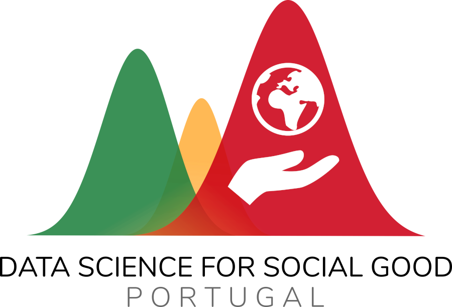

# 🔥🗺️ Mini-Projecto Mapa de Incêndios Rurais: as últimas décadas 

Este é o repositório do Mini-Projecto **Mapa de Incêndios Rurais: as últimas décadas**.

## 🤔 Contexto

Atingindo o seu pico no Verão, os incêndios rurais são um flagelo do nosso país há já várias décadas. São dezenas de milhares de hectares de área ardida todos os anos, com incontáveis perdas materiais e, nos casos mais extremos, de vida humana. Estes incêndios resistem de forma impérvia às várias estratégias (implementadas ao nível da resposta central, local, regulatória e legal) e melhorias técnicas empregues no seu combate. 

Todos os anos, é comum os órgãos de comunicação social exibirem os mapas da área ardida durante a chamada _“época de incêndios”_. Surpreendentemente, as últimas décadas de incêndios florestais no país têm associados muitos registos digitais. Surge então a pergunta: será que visualizar a evolução deste mapa ao longo das várias décadas nos permitirá perceber melhor o fenómeno dos incêndios? Permitirá uma visualização interactiva deste tipo desbloquear novas observações que informem a estratégia de combate aos incêndios ou pintem retratos mais exactos deste flagelo no país? 

## 🥅 Objectivo

O objetivo deste Mini-Projecto é criar um portal onde seja possível visualizar, sobre um mapa de Portugal, num horizonte temporal o mais alargado possível, a área ardida em todos os incêndios rurais de grande dimensão e presentes nos registos digitais das fontes oficiais. 

Este portal interactivo seria reminiscente do [fogos.pt](https://fogos.pt/) ou do [Wildfire Map do FWAC](https://www.fireweatheravalanche.org/fire/), mas mais focado na exploração interactiva de eventos passados. Cada incêndio teria, por exemplo, cor e dimensões proporcionais à sua magnitude em termos de área ardida (vulgo _heatmap_), permitindo assim, ao longo do tempo, visualizar onde no país estão os pontos de foco destes eventos e se estes variam.

## ⛲ Fontes de dados

- Dataset de incêndios florestais do Instituto da Conservação da Natureza e das Florestas (ICNF), com limpeza por parte da Central de Dados: [centraldedados/incendios](https://github.com/centraldedados/incendios/)
  - Abrange o período 1980-2015
  - Inclui área ardida
  - Registos mais antigos não têm latitude/longitude, mas têm freguesia (nomes pré-Reorganização Administrativa das Freguesias)
- _Dataset_ de ocorrências da Protecção Civil, com _scraping_ e limpeza por parte da Central de Dados: [centraldedados/protecao_civil](https://github.com/centraldedados/protecao_civil/)
  - Dados de 2016 a 2019, inclusive
  - Necessário filtrar por eventos de interesse
  - Contém instruções sobre como obter lista de eventos mais recentes (até Julho de 2020) directamente da API da Protecção Civil
- [Relatórios anuais de Incêndios rurais do ICNF](http://www2.icnf.pt/portal/florestas/dfci/relat/rel-if) 
  - Comtém lista dos 20 maiores incêndios rurais no período de cada relatório
  - Relatório em PDF, mas as tabelas com dados de interesse são facilmente extraíveis
- [_Dataset_ de mapeamento entre Códigos Postais e nomes de Freguesias, pós-Reorganização Administrativa das Freguesias](https://github.com/dssg-pt/mp-mapeamento-cp7)
- [Representações cartográficos ao nível do concelho de Portugal Continental e Ilhas](https://github.com/dssg-pt/covid19pt-data/tree/master/extra/mapas/concelhos) (em vários formatos) 

## 🧱 Principais etapas

1. Preparação do _dataset_
    1. Analisar as fontes de dados existentes e suas limitações
    2. Selecionar e recolher dados das fontes de dados mais relevantes
    3. Limpar e filtrar cada fonte de dados
    4. Harmonizção das várias fontes e junção dos dados
    5. Complementar dataset com outras fontes se necessário (_scraping_ da API da Protecção Civil, _scraping_ dos relatórios do ICNF, etc)
2. Design do portal
    1. Design (_mockups_ simples)
    2. Listar funcionalidades desejadas
    3. Definir _tech stack_
3. Desenvolvimento do portal
    1. Desenvolvimento
    2. Testes
    3. _Deployment_ (método em concreto a definir mediante a _tech stack_ escolhida)   
4. (opcional) Escrita de um _blogpost_ narrando a experiência e destacando eventuais descobertas/narrativas presentes nos dados 

(numa fase inicial, 1 e  2 são paralelizáveis, com um maior foco em 1)

## 🎯 Resultado final esperado

Os resultados finais esperados são:
- Um **portal interactivo público** com as funcionalidades desejadas, com o respectivo código disponível sob licença _open-source_
- **Repositório com o dataset compilado** que alimenta esse portal, disponível sob uma licença de dados abertos

_Mockup básica e meramente indicativa de um possível design do portal_

## 👥 Equipa

Este Mini-Projecto está pensado para uma equipa com, no máximo, **2 pessoas**, que devem idealmente conjugar mínima proficiência nas seguintes áreas: 

- Limpeza e pré-processamento de dados tabulares e cartográficos (Python/R ou similares) - os _datasets_ base têm na ordem das dezenas/centenas de milhares de entradas
- Construção de _frontend_ eficiente para visualização interactiva de mapas
  - Utilizando ferramentas de visualização cartográfica e construção de frontends do ecossistema Python/R (`folium`, `pydeck`, `streamlit`, `dash`, etc) **OU** equivalentes em JavaScript (`d3.js`, por exemplo)
  - _Deployment_ deste portal

## ⏲️ Duração prevista

Dado o tamanho da equipa e os resultados finais descritos, este mini-projecto tem uma duração estimada de **2.5 meses** (com a alocação de algumas horas por semana por cada membro da equipa). A duração estimada e objectivos do Mini-Projecto serão continuamente revistos, pela DSSG PT e pela equipa seleccionado, ao longo do mesmo. 

## 🔁 Reprodutibilidade

**TODO**: Ambientes virtuais, dependências, etc. 

# 👉 Chegaste aqui e queres juntar-te a este Mini-Projecto?

Envia-nos um e-mail para [volunteers@dssg.pt](mailto:volunteers@dssg.pt?subject=MP%20Incêndios) com o título _MP Incêndios_ e:
- CV e/ou LinkedIn
- Um pequeno parágrafo em que expliques o teu interesse e adequação a este desafio em concreto

--- 

## 📜 Sobre os Mini-Projectos

_Os Mini-Projectos são iniciativas da [DSSG PT](https://dssg.pt) em que uma pequena equipa de Voluntários trabalha de forma independente numa iniciativa concreta e a curto prazo que, baseada em dados abertos, visa gerar resultados valiosos para a sociedade em geral. A lista de Mini-Projectos activos pode ser [consultada no nosso GitHub](https://github.com/dssg-pt/)._
